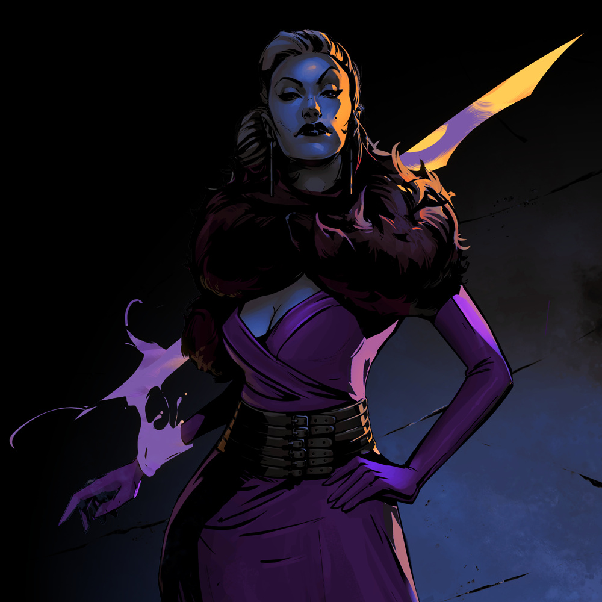
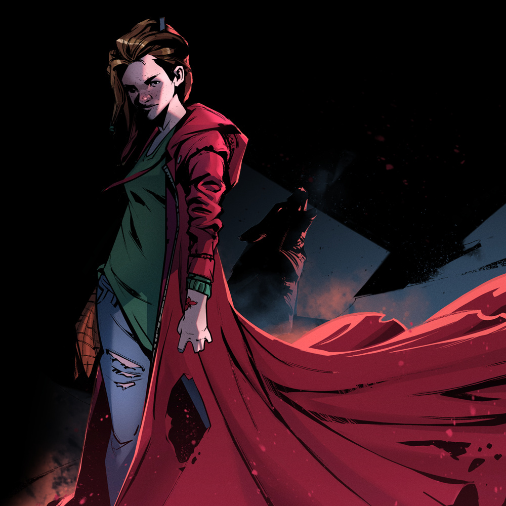

[Back to Index](./index.md)

---

## Campaign

> **Chaos Factor:** 5
>
> ==ADVENTURE FEATURES==
> **1-2:** Police Corruption
> `[_____][_____]`
> **3-4:** Mysterious Suicide (?)
> 
> ==THREADS==
> 
> ==CHARACTERS==
>  **1-2:** Enkidu
>  **3-4:** Excalibur
>  **5-6:** Scarlet
>  **7-8:** All-Seeing Eye Investigations

 

## Det. Enkidu

> ==MYTHOS==
> **Wild** (Expression)
> "When should I follow my instincts?"
> *In the dark recesses of her soul, Detective Enkidu harbors a feral creature, the heroic beastman Enkidu of ancient Mesopotamia. Can she trust its animalistic wisdom?*
>  &nbsp;&nbsp;• <u>Power</u>: unleash the beast within, thorny tentacles, feral athletics
>  &nbsp;&nbsp;• <u>Weakness</u>: uncouth brute
> 
> ==LOGOS==
> **Hard-Boiled Detective** (Training)
> "Never leave a case unsolved."
> *The detective has seen her fair share of rainy crime scenes surrounded by yellow tape. She knows the job, and she knows she shouldn't get involved, but she always does.*
>  &nbsp;&nbsp;• <u>Power</u>: police work, search for evidence, drive with lights and sirens
>  &nbsp;&nbsp;• <u>Weakness</u>: don't get too personal
> 
> **Standard Issue Gear** (Possessions)
> "Trust my gun better than I trust anyone here."
> *A badge and a gun are all a cop needs, according to Detective Enkidu. People may betray you, but well-maintained gear can always be trusted.*
>  &nbsp;&nbsp;• <u>Power</u>: police badge, access to police armory, standard issue pistol
>  &nbsp;&nbsp;• <u>Weakness</u>: gear screams "police"
> 
> **Precinct 23** (Turf)
> "Mess with Miller's Square, you mess with me."
> *For the last decade, Enkidu has been a part of Precinct 23, the police station watching over Miller's Square. Anything that happens on the streets of this neighborhood is her business.*
>  &nbsp;&nbsp;• <u>Power</u>: streets of miller's square, local small-time crooks, you're in my jurisdiction
>  &nbsp;&nbsp;• <u>Weakness</u>: corruption everywhere
>  &nbsp;&nbsp;• <u>Attention</u>: 1 • <u>Fade</u>: 0
> 
> ==COMBOS==
> `2` **Study a Crime Scene:** <u>Investigate</u>: police work, search for evidence
> `2` **Go Berserk on Someone:** <u>Go Toe to Toe</u> or <u>Hit With All You've Got</u>: unleash the beast within, thorny tentacles
> `3` **Threaten to Arrest Someone:** <u>Convince</u>: police work, police badge, you're in my jurisdiction
> `4` **Chase Someone Down an Alley:** <u>Go Toe to Toe</u>: streets of miller's square, you're in my jurisdiction, thorny tentacles, feral athleticism

> ==BACKGROUND==
> **Mythos:** Enkidu, the wildling of the epic of Gilgamesh
> **Logos:** Police detective
> **Abilities:** Standard issue police gear, Feral athletics
>  Thorny tentacles, Exceptionally self-driven and motivated
> **Affiliation:** All-Seeing Eye Investigations, Precinct 23, The people of Miller’s Square
> **Home District:** Miller's Square
> 
> Detective Enkidu is an experienced police officer and a Hard-Boiled Detective of Miller’s Square’s Precinct 23. For the past few months she has been secretly moonlighting with “All-Seeing Eye Investigations”, trying to get to the bottom of cold cases deemed ‘unworthy’ by her superiors, and re-opening ones that were suspiciously closed due to ‘lack of evidence’. Enkidu believes that a badge and a gun are all a cop needs. People may betray you, but well-maintained Standard Issue Gear can always be trusted. Despite her stone-cold exterior, she harbors inside her a creature of the Wild from Sumerian myth, who pushes her to break the very rules she fights to protect.
> 
> “Ever since I was a child on the streets, this urge, it was calling me to rip through all this ‘modern woman’ crap and just surrender to the wild, become a beast. When I answer that call, this facade of normality is not the only thing I tear through - so you better not get in my way…”

 

## Excalibur

> ==MYTHOS==
> **The Ultimate Weapon** (Relic)
> "Does justice call for violence?"
> *While searching for old documents in her family's mansion, Excalibur uncovered an elaborate silver bracelet that could transform into any weapon she imagined.*
> (These tags refer to the bracelet, not Excalibur herself.)
>  &nbsp;&nbsp;• <u>Power</u>: can transform into any weapon, inconspicuous in bracelet form, indestructible
>  &nbsp;&nbsp;• <u>Weakness</u>: very conspicuous in weapon form
> 
> ==LOGOS==
> **Activist for Social Change** (Mission)
> "I cannot tolerate injustice."
> *Excalibur heads a charitable foundation, working to bring better opportunities to the downtrodden populations of the City. She often goes out in disguise to witness life on the street in person.*
>  &nbsp;&nbsp;• <u>Power</u>: seasoned negotiator, contacts in every neighborhood, disguise
>  &nbsp;&nbsp;• <u>Weakness</u>: unreliable allies
> 
> **Wealthy and Dysfunctional Family** (Defining Relationship)
> "Without my family, I have no power."
> *Excalibur comes from old money. She is a member of one of the City's oldest and most renowned families whose wealth is only matched by its internal drama and strife.*
>  &nbsp;&nbsp;• <u>Power</u>: cushy bank account, family 'friends' in high places, certified accountant
>  &nbsp;&nbsp;• <u>Weakness</u>: "the old wo/man will find out.."
> 
> **Rich Old Dame** (Personality)
> "Never show weakness."
> *Excalibur isn't a spring chicken anymore and she prefers it this way. Life has taught her a lesson or two about how to stay ahead of the game.*
>  &nbsp;&nbsp;• <u>Power</u>: tough as a nail, bullshit detector, glamorous
>  &nbsp;&nbsp;• <u>Weakness</u>: sore joints
> 
> ==COMBOS==
> `2` **Make a Dazzling Party Entrance:** <u>Hit With All You've Got</u>: family 'friends' in high places, glamorous
> `3` **Expose Fishy Business:** <u>Investigate</u>: certified accountant, contacts in every neighborhood, bullshit detector
> `3` **Cut a Deal:** <u>Convince</u>: seasoned negotiator, cushy bank account, family friends' in high places
> `1` **Shape a Weapon and Attack:** <u>Go Toe to Toe</u> or <u>Hit With All You've Got</u>: transform into any weapon

> ==BACKGROUND==
> **Mythos:** Excalibur, the legendary sword of Arthurian legend
> **Logos:** Old-money socialite
> **Abilities:** The ultimate weapon, Seasoned negotiator, Friends in high places, Cushy bank account
> **Affiliation:** Charities throughout the City, her family, the City’s crème de la crème
> **Home District:** The Gated Community
> 
> Contrary to what many may think, there’s more to Excalibur than just a bitter Rich Old Dame. True, she was born to a Wealthy and Dysfunctional Family if there ever was one, but as a secret Activist for Social Change, she has her own plans for the City: plans that became possible when she found a silver bracelet which turned out to be The Ultimate Weapon in disguise.
> 
> “If you want to do good in the world, the first thing you need to worry about is power. That’s right, you heard me correctly. So, if you care about this City, if you want to be able to change things for the better, you need to be able to exert some influence on those who benefit from the status-quo.”

 

## Scarlet

> ==MYTHOS==
> **Red Hood** (Relic)
> "Why did the Hood choose me?"
> *On the fateful night when her girlfriend Jill was kidnapped, distraught Scarlet found a red hooded coat hanging in her closet. The Hood gave her the power to hunt down and defeat those who would harm the young and innocent.*
>  &nbsp;&nbsp;• <u>Power</u>: protected by the cloak, conjure hunting weapon, "I always find my prey"
>  &nbsp;&nbsp;• <u>Weakness</u>: bloodlust
> 
> **Innocuous Threat** (Subversion)
> "Can I ever be innocent again?"
> *As the chosen of the Hood, Scarlet uses her harmless appearance as the perfect cover from which to pounce at her prey and deliver a deadly blow.*
>  &nbsp;&nbsp;• <u>Power</u>: harmless little girl, surprise attack, lurk in hiding (also in Hood)
>  &nbsp;&nbsp;• <u>Weakness</u>: "You're just a little girl..."
> 
> ==LOGOS==
> **Young Love** (Defining Relationship)
> "I'd rather die than lose Jill!"
> *Scarlet and Jill first met in class in their suburbian high-school. Fascinated with each other, their friendship quickly evolved into much more. When Scarlet saved Jill, they became inseparable.*
>  &nbsp;&nbsp;• <u>Power</u>: strength to go on, empathetic, cute together
>  &nbsp;&nbsp;• <u>Weakness</u>: daydreams
> 
> **Wall-Flower** (Personality)
> "Don't let them see me!"
> *There's a lot you can learn from just watching people. Shy and introverted, Scarlet prefers to do the watching over being watched.*
>  &nbsp;&nbsp;• <u>Power</u>: anonymity, trustworthy, observant
>  &nbsp;&nbsp;• <u>Weakness</u>: painfully shy
> 
> ==COMBOS==
> `2` **Track Someone:** <u>Investigate</u>: "I always find my prey", observant 
> `3` **Strike From the Shadows:** <u>Hit With All You've Got</u>: conjure hunting weapon, surprise attack, lurk in hiding (also in Hood)
> `3` **Blend Into the Crowd:** <u>Sneak Around</u>: harmless little girl, lurk in hiding (also in Hood), anonymity
> `3` **Disarm With Sweetness:** <u>Convince</u>: harmless little girl, empathetic, trustworthy

> ==BACKGROUND==
> **Mythos:** Little Red Riding Hood
> **Logos:** Teenage wallflower
> **Abilities:** A magical protective Hood, Conjure hunting weapons, Legendary stealth and perception, Harmless appearance
> **Affiliation:** Her girlfriend Jill, Her mysterious seemingly-sentient Hood
> **Home District:** Happyville (Suburbia)
> 
> Scarlet found the Red Hood on one fateful night when her girlfriend, Jill, was kidnapped. She has vowed to never again let anyone separate them. Their Young Love continues to blossom and they’ve become inseparable - it's Jill and Scarlet to the very end! The powers given to her by the Hood help her track and hunt down those who would harm the young and innocent. This teenage Wall-Flower's harmless appearance and dislike for the spotlight give her the edge she needs to pounce on her prey and deal a deadly blow when least expected. Despite her Innocuous Appearance Scarlet is a natural hunter and as deadly as they come.
> 
> “When Jill got kidnapped, I thought I would lose myself - instead, I found myself - or did it find me? With this Hood, I became the hunter. We’re now a thing, the Hood and me - oh, and Jill and me, of course! I only hope Jill never, ever finds out how terrible, how… dangerous, I can become.”

  

## Crew

> **Masked Vigilante Investigations** 
> "Wherever the law fails to stop crime, we need to step in."
> *You all agree on one thing the wrongs you've seen cannot be allowed to continue. Whether you met in a street fight or while doing some detective work, you probably have at least one successful team. Investigation under your belt, such as
>  &nbsp;&nbsp;• Bringing a serial criminal to justice
>  &nbsp;&nbsp;• Shutting down a crime lord's operation in your district
>  &nbsp;&nbsp;• Exposing corrupt officials*
>  &nbsp;&nbsp;• <u>Power</u>: office space, got each other's back, blow off some steam
>  &nbsp;&nbsp;• <u>Weakness</u>: stepping on each other's toes

> ==BACKGROUND==
> A year ago, Enkidu was investigating a cry for help written on a mysterious note, which quickly lead to the discovery of a deep mafia influence backed by persons with supernatural powers. Attempts to investigate further were shut down by her superiors, who were obviously in the pocket of the mob, so she started her own unofficial investigation.
> 
> While following up on the rumor of a stylist dating one of the local mob bosses, Enkidu found a woman wearing a mystical bracelet standing outside of a hair salon. The woman was Excalibur and she had regularly patroned the establishment while in disguise, gathering local gossip to keep an eye on the district. The salon was not the only victim, and shops across the district had closed under the pressure of the mafia. Excalibur offered to lend her power and financial backing to remove the mafia influence from Miller's Square and Enkidu gratefully accepted.
> 
> During the course of their investigation, Enkidu and Excalibur came across Scarlet, a young girl who was out of her mind with worry over the abduction of her girlfriend Jill. It appeared that Jill had caught the eye of the mafia consigliere and he used his supernatural power of suggestion to enamor her, collecting her as a pet to keep in the backroom of his speakeasy.
> 
> The group freed Scarlet's girlfriend and discovered the source of the enforcers' supernatural abilities: a yearly feast of Ambrosia, a magical dish that grants godlike powers. They raided the feast and defeated the consigliere and a small army of mafia enforcers. Also present was a crazy shark lady enforcer and an ominous man controlling three dogs, but the pair escaped with a crate of Ambrosia.
> 
> Though the Ambrosia supply line had been cut, the shark lady later re-emerged to take the consigliere's place as the one controlling Miller's Square. Enkidu swore to continue her mission of freeing Miller's Square from the mafia influence and removing the corruption from her precinct. This aligned with Excalibur's goals and so she offered to lend her services when she could. Scarlet, grateful for the help in rescuing her girlfriend, also agreed to provide assistance, outside of school hours. The trio set up an informal base of operations in a closed-down office left behind by one of Enkidu's old colleagues. They tentatively named it "All-Seeing Eye Investigations."
> 
> 

 

## Locations

>  **Miller's Square:** All-Seeing Eye Investigations - MC Booklet, case setting
>  **All-Seeing Eye Investigations:** All-Seeing Eye Investigations - MC Booklet, pg. 13
>  **Precinct 23:** All-Seeing Eye Investigations - MC Booklet, pg. 29
>  **The Gated Community:** Master of Ceremonies' Toolkit, pg. 46
>  **Happyville:** Amnesia Town, case setting

  